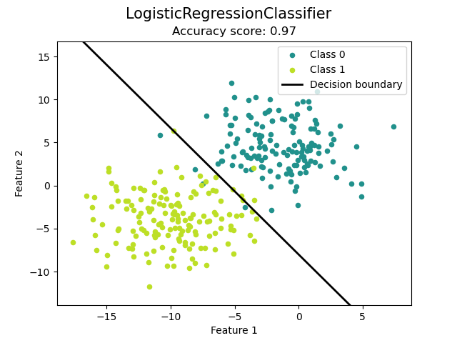

[](https://mit-license.org/)

# Machine learning models

Implementations of several machine learning models and algorithms from scratch in Python using the [NumPy](https://numpy.org/)
library for efficient numerical computations and [matplotlib](https://matplotlib.org/) for data visualization.

These implementations are not meant be used in production machine learning systems, but as a way of understanding
the internals and working principles of the algorithms available in well known frameworks such as
[TensorFlow](https://www.tensorflow.org/) and [PyTorch](https://pytorch.org/).

---

## Installation

The `mlmodels` package can be installed by running the following sequence of commands.

```bash
$ git clone https://github.com/rixsilverith/machine-learning-models
$ cd machine-learning-models
$ python3 setup.py install
```

> **Note** You may need to run the `setup.py` file with root priviledges.

### Requirements

*mlmodels* depends on the following packages:

- [numpy](https://numpy.org/) - Efficient numerical computing library for Python.
- [matplotlib](https://matplotlib.org/) - Plotting library for Python

---

## Some examples

### Logistic Regression model

```bash
$ python3 examples/logistic_regression.py
```
This example generates a dataset suited for binary classification, fits a logistic regression model
using the Stochastic Gradient Descent optimizer to the generated data and plots the decision boundary
for the problem.



---

## List of implemented models

The following is a list of the currently implemented models.

### Linear models

**Model name** | **Implementation** | **Used for**
--- | --- | --- 
Logistic Regression | [`LogisticRegressionClassifier`](mlmodels/linear_models/logistic_regression.py) | Binary classification

---

## License

The MIT License. See [LICENSE](LICENSE) for more information.

